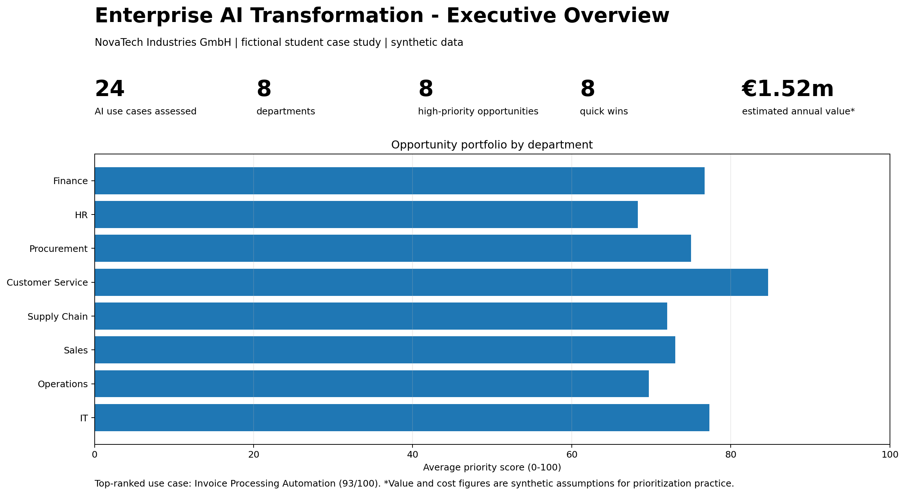
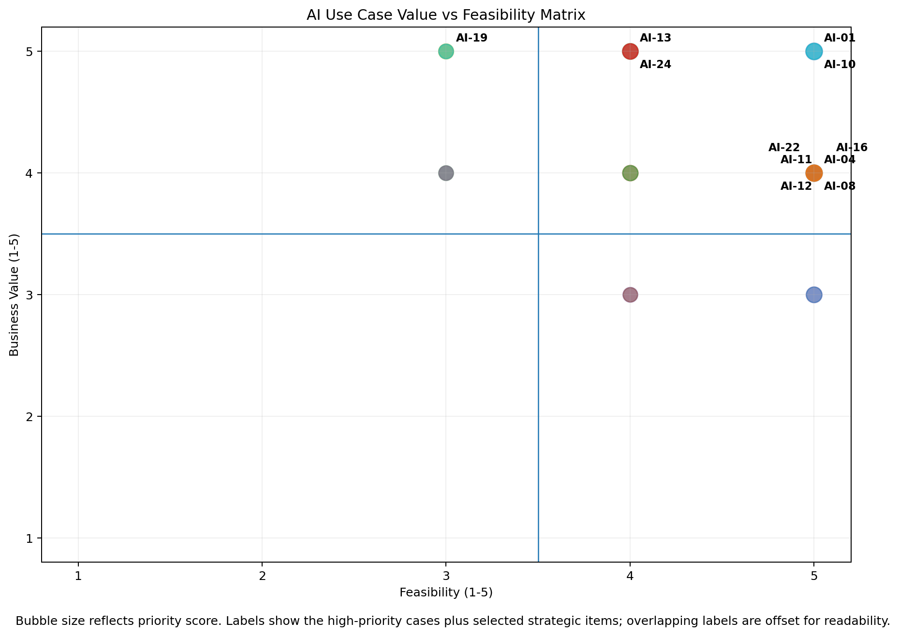
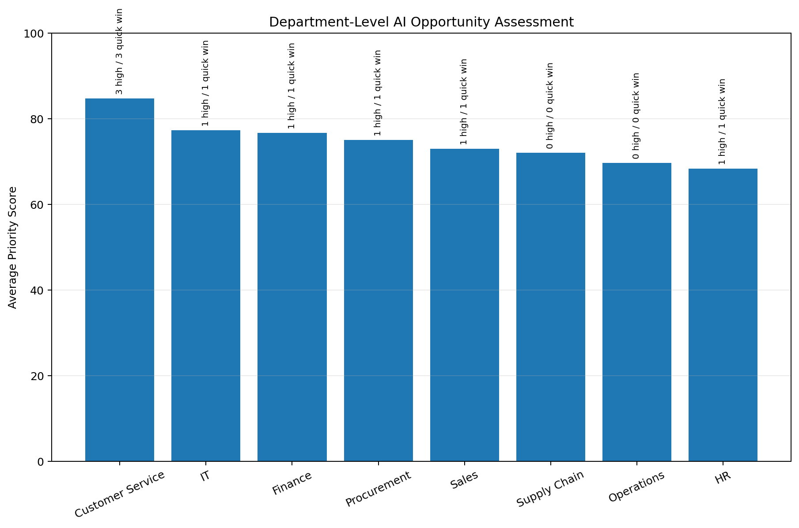
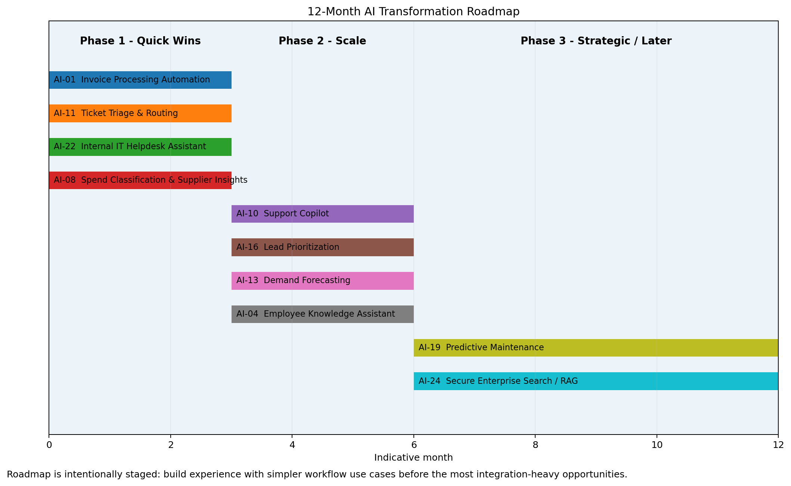
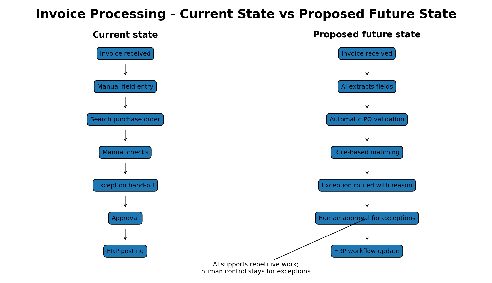
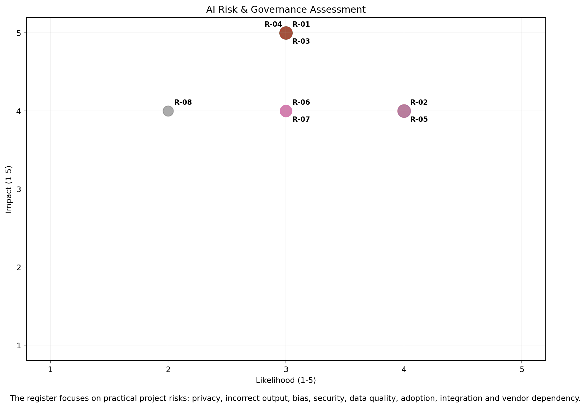

# Enterprise AI & Digital Transformation - Use Case Prioritization

> Independent student portfolio project using a fictional company and fully synthetic data.

I built this project to practice a question that comes up in many **Business Analyst, Digital Transformation, Data & AI and IT Project Management** roles:

**If a company has many AI ideas, how do you decide what should actually be piloted first?**

Instead of building another chatbot demo, I treated the topic as an early-stage business transformation problem. I created a portfolio of 24 AI use cases across eight departments, scored them using a transparent prioritization model, identified quick wins, and translated the results into a phased roadmap.

## Project at a glance

- **24** AI use cases
- **8** business departments
- **8** high-priority opportunities
- **8** quick-win candidates
- **€1.52m** synthetic estimated annual value across the high-priority group
- **€0.50m** synthetic estimated implementation cost across the high-priority group
- Highest-scoring use case: **Invoice Processing Automation (93/100)**



## The business problem

NovaTech Industries GmbH is a fictional mid-sized industrial company. Different departments have proposed AI ideas, but management cannot fund everything at once.

The task is to create a simple decision framework that balances:

- business value
- feasibility
- data readiness
- implementation effort
- risk
- basic ROI attractiveness

The output should be understandable to a business stakeholder, not only to a data scientist.

## What I did

### 1. Built an AI use-case register

I documented 24 opportunities across Finance, HR, Procurement, Customer Service, Supply Chain, Sales, Operations and IT.

Each idea includes the business problem, proposed AI approach, key stakeholders, estimated value/cost, implementation effort and risk assumptions.

### 2. Created a prioritization model

The final score uses six dimensions:

| Dimension | Weight |
|---|---:|
| Business Value | 30% |
| Feasibility | 20% |
| Data Readiness | 15% |
| Ease of Implementation | 15% |
| Risk Advantage | 10% |
| ROI Attractiveness | 10% |

The model is intentionally simple. In a real project I would expect the weights and estimates to be challenged by Finance, IT, process owners, information security and data protection.



### 3. Compared the opportunity portfolio by department

The department view helped me see that a strong AI portfolio is not just about the department with the biggest theoretical value. Some functions have better near-term opportunities because the workflows and data are easier to work with.



### 4. Proposed a phased roadmap

I separated the portfolio into:

- **Phase 1 - Quick Wins (0-3 months)**
- **Phase 2 - Scale (3-6 months)**
- **Phase 3 - Strategic / Later (6-12 months)**

This prevents the roadmap from becoming a list of 24 projects that all supposedly start at the same time.



### 5. Mapped one process transformation

For **Invoice Processing Automation**, I compared the current manual process with a possible future state.

The key design choice is that AI handles repetitive extraction and matching, while people remain responsible for exceptions and financial controls.



### 6. Added stakeholders and AI risks

I created a stakeholder map and a small risk register covering privacy, incorrect outputs, bias, security, source-data quality, user adoption, integration complexity and vendor dependency.



## Main files

### `analysis/Enterprise_AI_Transformation_Assessment.xlsx`

The main Excel workbook. It contains:

- `START_HERE`
- `Use_Cases`
- `Prioritization`
- `Department_Summary`
- `Roadmap`
- `Stakeholders`
- `Risk_Register`
- `Executive_Dashboard`

The prioritization sheet calculates the score using formulas rather than hard-coded final rankings.

### `data/`

Contains the synthetic source tables used in the project:

1. `01_ai_use_cases.csv`
2. `02_prioritization_scores.csv`
3. `03_department_assessment.csv`
4. `04_implementation_roadmap.csv`
5. `05_stakeholder_map.csv`
6. `06_risk_register.csv`

### `docs/`

- `Business_Requirements.md` - business requirements and acceptance criteria
- `Scoring_Methodology.md` - scoring logic and limitations
- `Invoice_Process_Transformation.md` - current vs future process notes
- `Enterprise_AI_Transformation_Executive_Summary.pdf` - short recruiter-friendly summary

## Skills demonstrated

- Business analysis
- AI use-case evaluation
- Digital transformation
- Prioritization and decision frameworks
- Excel modelling
- Process mapping
- Stakeholder analysis
- Risk and governance thinking
- Roadmap / PMO-style planning

## What I learned

The biggest lesson from the exercise was that the **most exciting AI use case is not automatically the best first project**.

A useful first pilot also needs a clear owner, usable data, manageable risk, an achievable implementation scope and a result that can actually be measured.

That is why some workflow and knowledge use cases rank ahead of technically more ambitious ideas such as predictive maintenance.

## Limitations

This project is an educational case study, not a real consulting engagement or AI implementation.

- NovaTech Industries GmbH is fictional.
- All data, value estimates, costs and timelines are synthetic.
- The scoring weights are judgement-based assumptions created for learning.
- No production AI model was trained or deployed.
- Real implementation decisions would require technical architecture, legal, security, data-protection and financial validation.

## Repository structure

```text
enterprise-ai-transformation/
├── README.md
├── analysis/
│   └── Enterprise_AI_Transformation_Assessment.xlsx
├── data/
│   ├── 01_ai_use_cases.csv
│   ├── 02_prioritization_scores.csv
│   ├── 03_department_assessment.csv
│   ├── 04_implementation_roadmap.csv
│   ├── 05_stakeholder_map.csv
│   └── 06_risk_register.csv
├── docs/
│   ├── Business_Requirements.md
│   ├── Scoring_Methodology.md
│   ├── Invoice_Process_Transformation.md
│   └── Enterprise_AI_Transformation_Executive_Summary.pdf
└── screenshots/
    ├── 01_executive_overview.png
    ├── 02_value_feasibility_matrix.png
    ├── 03_department_analysis.png
    ├── 04_implementation_roadmap.png
    ├── 05_invoice_process_transformation.png
    └── 06_risk_governance.png
```

---

